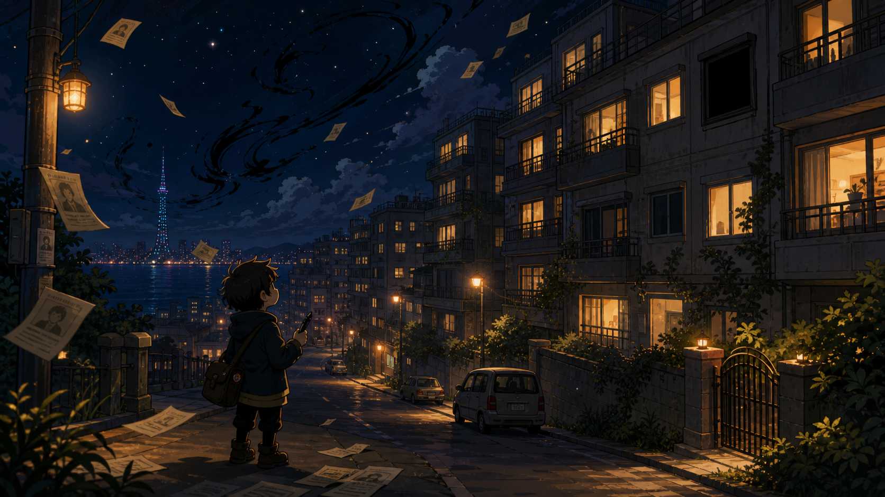
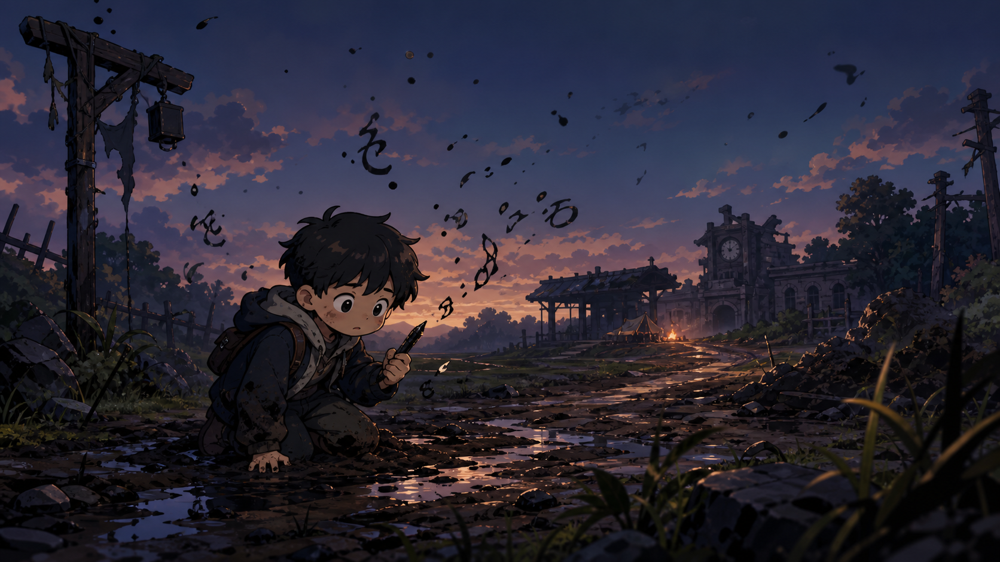
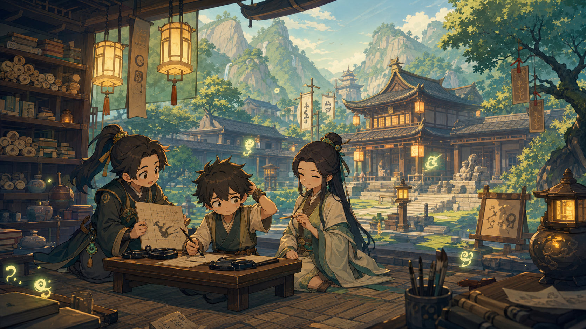
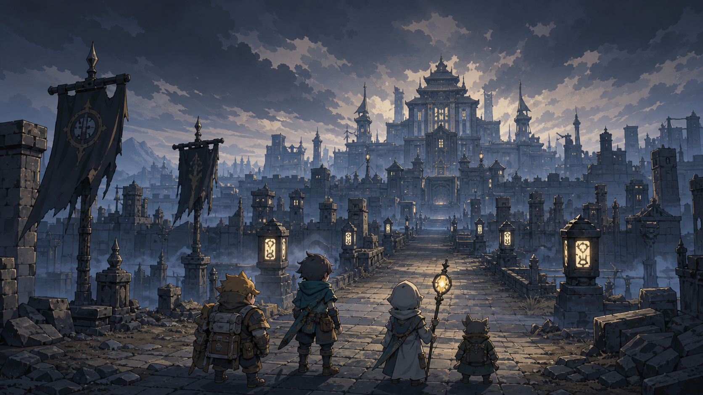
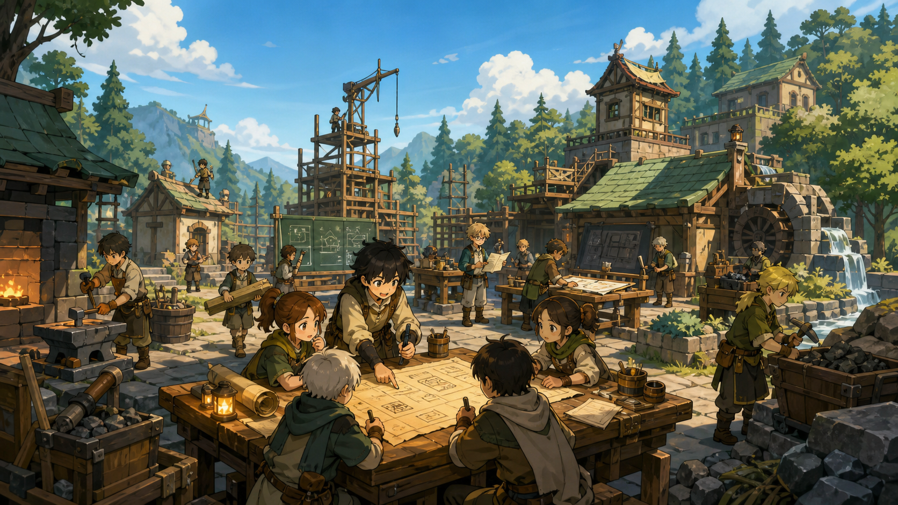
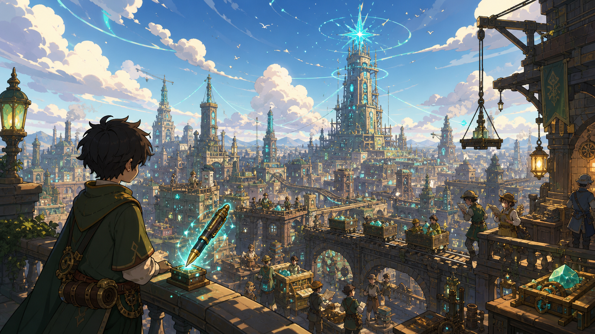
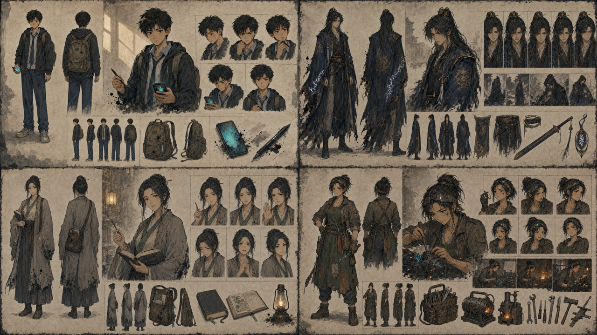
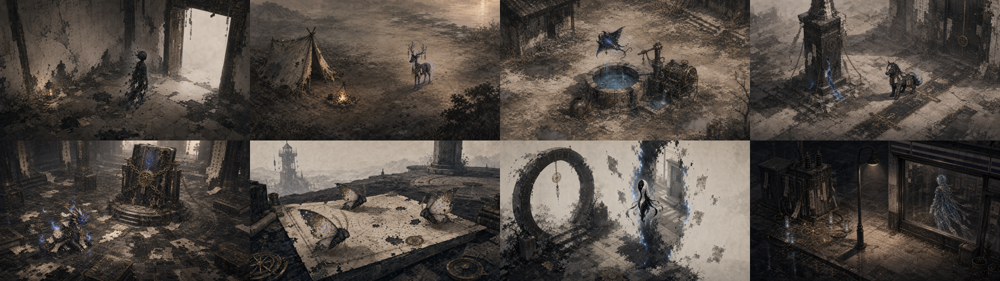

# Dream Coastline

<div align="center">


[](https://godotengine.org/)
[](https://creativecommons.org/publicdomain/zero/1.0/)
[](https://github.com/phodal/dream-coastline)

**A 90s-style narrative RPG where names, memory, and light have started to fail.**

</div>

---

Dream Coastline is an open-source narrative RPG prototype built with [Godot 4](https://godotengine.org/).
Set in a city slowly losing its language and memory, the game turns story into explorable scenes,
inspectable objects, and cutscene moments driven entirely by versioned data files.

The project is currently a playable development slice, not a finished game. The main runtime is
the Nova narrative layer at `res://src/nova/main.tscn`, with Dialogic used as the cutscene
frontend when available.

---

## Gallery

<div align="center">

| Chapter 0 · Prologue | Chapter 1 · Illiterate | Chapter 2 · Moqi Academy |
|:---:|:---:|:---:|
|  |  |  |
| *The night the lights went out* | *A person who cannot write* | *Where scripts are taught and lost* |

| Chapter 3 · Dead Kingdom | Chapter 4 · Continuation | Chapter 5 · Century |
|:---:|:---:|:---:|
|  |  |  |
| *The city that refused to remember* | *An institute trying to save language* | *A hundred years of missing pages* |

</div>

---

## Characters

<div align="center">



*Main cast: Jizi Xuan, Xiali, Wensu, and Atang*

</div>

The story follows four characters through eight chapters, each carrying a
different relationship to the city's failing language and fading memory.

---

## Story Chapters

| # | Title | Setting |
|---|-------|---------|
| 0 | 序幕：灯未亮起的夜晚 — *Prologue: The Night Before the Lights Came On* | Home, bedroom, street |
| 1 | 第一幕：不会写字的人 — *Act 1: The Illiterate* | Outskirts, mud road |
| 2 | 第二幕：墨颀书院 — *Act 2: Moqi Academy* | Academy, archive |
| 3 | 第三幕：死去的王国 — *Act 3: Dead Kingdom* | Ruins, propaganda walls |
| 4 | 第四幕：续文院 — *Act 4: Continuation Institute* | Workshop, mine |
| 5 | 第五幕：百年续页 — *Act 5: Century Continuation* | Star chart room, night school |
| 6 | 第六幕：归星计划 — *Act 6: Return Star Plan* | Dockyard, council chamber |
| 7 | 第七幕：灯重新亮起 — *Act 7: Lights On Again* | Bridge, final silence |

---

## Features

- **Keyboard-driven RPG exploration** with visible locations, exits, and inspectable story objects.
- **Eight authored story chapters**, from the prologue through *Lights On Again*.
- **Nova runtime** for scene progression, story flags, location choices, and story-action payloads.
- **Save / continue** — restores current scene, location, and story flags.
- **Pause menu** with resume, save, return-to-title, and exit.
- **Dialogic integration** — timeline generation and bridge support for native Godot dialogue playback.
- **Moqi script** — a custom in-world writing system with authored glyphs and font tooling.
- **Creature compendium** — eight creatures with concept art, habitat illustrations, and walk cycles.
- **Data-driven pipeline** — story scenes, visual scenes, characters, audio cues, and animation clips all live in versioned JSON under `data/`.
- **Screenshot tooling** — capture and review scene readability with contact sheets and manifests.
- **Desktop export** — macOS, Windows, and Linux export presets included.

### Moqi Script & Creatures

<div align="center">

| Moqi Script Sample | Creature Habitats |
|:---:|:---:|
|  |  |
| *In-world glyph system* | *Eight named creatures* |

</div>

## Quick Start

1. Install [Godot 4.6.x](https://godotengine.org/download/).
2. Clone this repository.
3. Open the project in Godot and let the initial import finish.
4. Press **F5** (or use **Project → Run**) to launch the game.

From the command line (macOS example; adjust path for your OS):

```sh
# Open the editor
/Applications/Godot.app/Contents/MacOS/Godot --editor --path .

# Run directly
/Applications/Godot.app/Contents/MacOS/Godot --path .
```

> **Note:** On first import, let Godot finish importing all project resources
> before running smoke tests or taking screenshots.

---

## Controls

| Action | Keyboard |
| --- | --- |
| Move | WASD / Arrow keys |
| Interact / advance | Space / Enter |
| Continue from title | C, when a Nova save exists |
| Pause / back | Esc |

Gamepad support is available through the Godot input map for movement,
interaction, and cancel/start-style actions.

## Development Setup

The repository expects these local tools for the full workflow:

- Godot 4.6.x
- Python 3
- Rust toolchain, only when working on the GDExtension crate
- Node.js / npm, only for selected audio-generation helpers
- .NET toolchain with `ysc`, only when regenerating Yarn Spinner artifacts

Build the optional Rust GDExtension library:

```sh
cargo build
```

Build release libraries for export presets:

```sh
tools/build_release_libraries.sh
```

## Testing

Most changes should start with the quick gate:

```sh
python3 tools/run_automated_tests.py --tier quick
```

Use the headless gate before opening a pull request:

```sh
python3 tools/run_automated_tests.py --tier headless
```

Use the visual gate when touching scene layout, HUD, visual assets, tile
generation, character art, or animation clips:

```sh
python3 tools/run_automated_tests.py --tier visual
```

The tier definitions and acceptance rules are documented in
[`docs/automated-testing.md`](docs/automated-testing.md).

Useful focused checks:

```sh
/Applications/Godot.app/Contents/MacOS/Godot --path . --headless --quit-after 100 -- --smoke-nova-runtime
/Applications/Godot.app/Contents/MacOS/Godot --path . --headless --quit-after 100 -- --smoke-nova-progression
/Applications/Godot.app/Contents/MacOS/Godot --path . --headless --quit-after 100 -- --smoke-nova-save-continue
/Applications/Godot.app/Contents/MacOS/Godot --path . --headless --quit-after 100 -- --smoke-nova-pause-flow
/Applications/Godot.app/Contents/MacOS/Godot --path . --headless --quit-after 100 -- --smoke-dialogic-bridge
python3 tools/validate_story_continuity.py --verbose
python3 tools/validate_dialogic_timelines.py
python3 tools/build_nova_manual_route_checklist.py --check
```

Capture a visual review set from the active Nova screenshot path:

```sh
python3 tools/capture_scene_screenshots.py --scope starts
python3 tools/validate_scene_screenshot_manifest.py --scope starts --visual-style classic_dark
```

This writes review artifacts under `artifacts/scene-screenshots/latest/`.
The `screenshots` automated step runs both commands. Screenshot review is
required for visual readability; render smoke only proves that the frame is not
blank.

For live full-route QA, use
[`docs/nova-full-route-manual-qa.md`](docs/nova-full-route-manual-qa.md). It is
generated from story walkthrough JSON and covers the 8-scene route, expected
flags, focus recovery, pause/save, and scene completion checks.

## Repository Layout

| Path | Purpose |
| --- | --- |
| `src/nova/` | Current runtime: scene director, exploration view, VN layer, Dialogic bridge, and autoload state. |
| `data/story_scenes/` | Authored chapter and location content. |
| `data/visual_scenes/` | Visual scene metadata consumed by Nova. |
| `dialogic/` | Generated Dialogic characters and timelines. |
| `assets/` | Branding, character art, illustrations, fonts, UI assets, and visual tiles. |
| `tools/` | Validation, generation, screenshot, audio, and release helper scripts. |
| `docs/` | Testing, release, Sprint Sheet, visual, audio, and design notes. |
| `addons/` | Vendored Godot plugins such as Dialogic and Yarn Spinner experiments. |

## Content Pipeline

The project treats story and scene data as source files. Common workflows:

- Generate Dialogic timelines from story data with
  `tools/generate_dialogic_timelines.py`.
- Validate timeline drift with `tools/validate_dialogic_timelines.py`.
- Validate cross-chapter story continuity with
  `tools/validate_story_continuity.py --verbose`.
- Build and validate Moqi script font assets with `tools/build_moqi_font.py`
  and `res://tools/validate_moqi_font.gd`.
- Prepare AI-assisted scene work with `tools/build_sprint_sheet_prompt.py`
  and validate the resulting contracts with
  `tools/validate_scene_ai_contract.py`.
- Treat `tools/record_story_review.py` as legacy DreamField/OpenRPG tooling; it
  requires `--legacy-openrpg-entrypoint` and is not a Nova complete-flow gate.

More detail is available in:

- [`docs/sprint-sheet-architecture.md`](docs/sprint-sheet-architecture.md)
- [`docs/sprint-sheets/`](docs/sprint-sheets/)
- [`docs/character-visual-models.md`](docs/character-visual-models.md)
- [`docs/ai-dialogue-voice-pipeline.md`](docs/ai-dialogue-voice-pipeline.md)
- [`docs/release.md`](docs/release.md)

## Contributing

Contributions should keep runtime behavior, source data, and validation in
sync. A good change usually includes:

1. A focused code or data diff.
2. The smallest relevant automated gate from the testing section.
3. Screenshot evidence when the change affects visual readability.
4. Updated docs when a workflow, command, or data contract changes.

Please avoid committing generated review artifacts unless they are part of the
change being reviewed.

## License

See [`LICENSE`](LICENSE) for repository license details.
